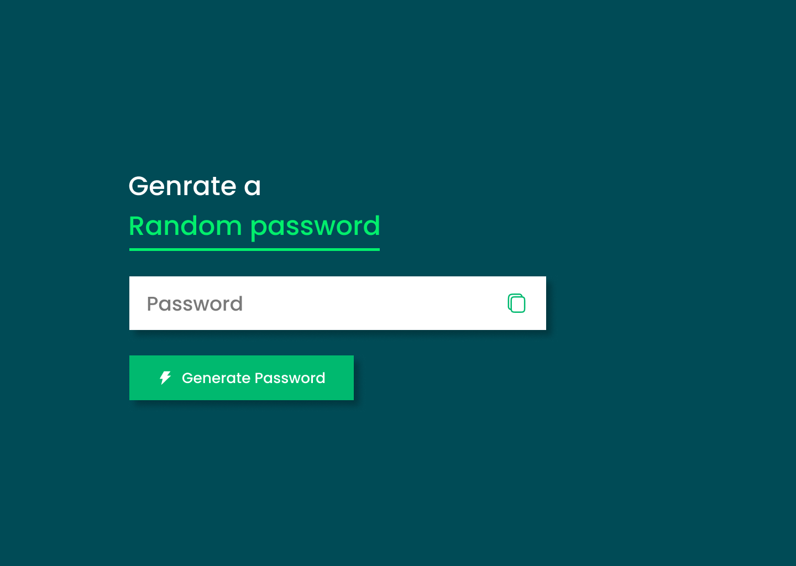

# Random Password Generator  

This is a simple Random Password Generator built using **HTML**, **CSS**, and **JavaScript**. The project design was created in **Figma**, focusing on a user-friendly interface and functionality.

## 🚀 Features  
- Generate secure and random passwords.    
- Copy generated password to clipboard with one click.  
- Responsive design for seamless use on various devices.

## 📸 Preview  

  
    

  
## 🛠️ Technologies Used  
- **HTML**: Structure of the application.  
- **CSS**: Styling and layout.  
- **JavaScript**: Logic for generating passwords.  
- **Figma**: UI/UX design.

---

## Live Demo  
[**View the Live Project**](https://dark1arrow.github.io/Random-Password-Genrator/)  

## Figma Design  
[**View Figma Design**](https://www.figma.com/design/rervNKegOt7yXEDeSnH9UC/java-script-project?node-id=80-4&t=TCNRytlHGbAmwfkc-1)  

## LinkedIn 
[**Check LinkedIn**](https://www.linkedin.com/in/gouatm-khanna-61ba63262/?utm_source=share&utm_campaign=share_via&utm_content=profile&utm_medium=android_app)
  